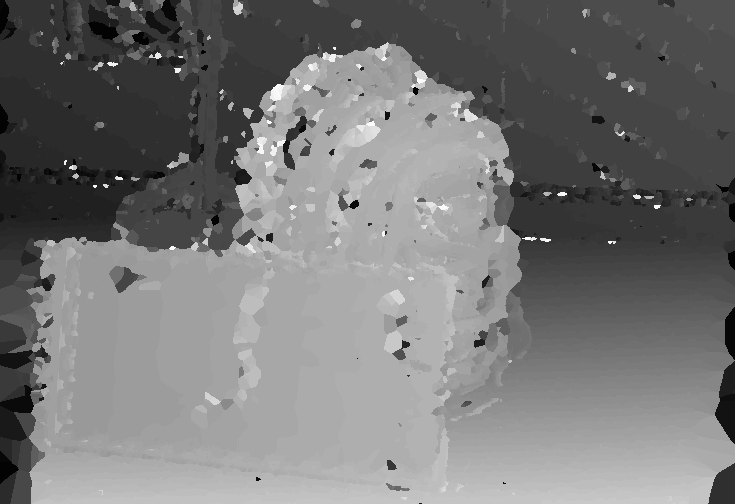

# OpenCL stereo disparity algorithm - Multiprocessor programming exercise
We have implemented an algorithm for creating a depth map using two images taken of the same scene with an offset in the horizontal axis. The program was originally created in C++, then ported to OpenCL to perform computations a desktop/laptop GPU, and finally the OpenCL code was adapted to be run on the Odroid-XU4 embedded system, using its Mali GPU to perform the algorithm.

The algorithm consists of three distinct parts: Preprocessing, wherein the input images are resized and greyscaled; The algorithm itself, where a disparity map is calculated by using zero-mean normalized cross-correlation (ZNCC) as the likeness criteria; and the post-processing, where the disparity maps of both images are cross-checked and the non-correlating pixels are filled with nearest neighbours.

The final algorithm uses a `MAX_DISP` of 64, a square, constant window of `WIN_SIZE` 9 centered around each pixel. The threshold value used for cross-check is 8 (in the range 0..`MAX_DISP`).

Output of the algorithm using final OpenCL implementation. Input used was im0.png and im1.png found under opencl-impl

## Preprocessing
In all implementations, the images are resized by taking a pixel from every 4th row and every 4th column, which is converted from RGBA values to 8-bit integer values, and outputting it to a smaller image. This resized greyscale image is used for further steps.

The greyscale values are calculated as Y=0.2126R+0.7152G+0.0722B

## Disparity algorithm
The disparity algorithm is implemented largely as the provided pseudocode describes, except for the window mean values. In the C++ implementation, the mean of each window is calculated within the disparity value loop, except for the "left" pixel which can be calculated before the loop. In the OpenCL implementations, however, the window means of each pixels are calculated beforehand in a separate step, and used as input for the disparity algorithm. This is done 
to avoid calculating the window mean every time several times (up to MAX_DISP*2 times, e.g. about 100-150).

The disparity algorithm is applied first with a disparity range of 0..MAX_DISP, and then with the range -MAX_DISP..0 with the image inputs swapped, wherein the second iteration calculates

## Post-processing
The post processing is performed in two steps: cross-check and occlusion fill.

Cross-check is performed by comparing corresponding between the two disparity images, and outputting the value from the left-hand disparity image if their difference is smaller than or equal to a given threshold, and 0 otherwise. Simultaneously, the pixel value is scaled to the range 0..255 from 0..MAX_DISP to produce a more appealing end result.

The occlusion takes the single image produced by the cross-check and outputs for each pixel the nearest non-zero pixel (itself if applicable), using euclidean distance as nearness criteria.

The final output is written to disk after the occlusion fill.

## OpenCL details
The OpenCL implementation consists of 5 kernels: `resize`, `calculate_mean`, `calculate_zncc`, `cross_check` and `nearest_nonzero`.

### resize
This kernel uses a range of x=0..(width/4)-1 and y=0..(height/4)-1, for each pixel in the output image. Images are read and written using OpenCL `image` objects in global memory. There is no need to use local memory as reads and writes are performed for only one pixel per work-group.

The initial OpenCL (and the C++) implementation iterates over all of the original image pixels, but that was optimized using the above.

### calculate_mean
This kernel also uses the same pixel-wise `global_id`s as the `resize` kernel, although it could possibly be optimized by using local memory to store values that are frequently reused. Another way to optimize this would be to remember column sums and carry them over when progressing through the computation. However, the time used by this operation is also very small compared to `calculate_zncc` that most optimizations would be negligible. 

### calculate_zncc
Initially, this kernel used the same indexing as above, where each work group only had one work item that went through all possible disparity values. This was improved by assigning one work item for each disparity value, so that much of the input could be shared between the work group. The `MAX_DISP` value was limited to 64 due to a hardware limitation of max work items. Larger `MAX_DISP` would require computing the disparity in separate ranges, eq. 0..64, 65..100 and then combining the results.

One optimization that would be possible, but was not implemented, is utilizing the fact that `ZNCC(L,R,x,y,d)` is equal to `ZNCC(R,L,x-d,y,-d)` -- knowing this, the ZNCC values for each pixel and disparity value could be computed once, and the argmax for `d` (a much less expensive operation) could then be calculated separately. This could be performed for the entire image, or for one row at a time to save memory, where a `MAX_DISP * WIDTH` block could even fit in local memory for a great increase in speed.

### cross-check
The cross-check kernel reads from both `image2d_t`s in global memory and outputs to one `image2d_t`. Local memory would not help as each pixel is only accessed once.

### nearest_nonzero
This kernel performs the occlusion fill. It reads and writes ´image´ values from global memory. Local memory could possibly be used as surrounding pixels are accessed, but as the access pattern is somewhat unpredictable and the potential optimization insignificant compared to `calculate_zncc`, this optimization was not performed.

### additional optimizations
After doing the initial OpenCL-implementation with image objects we chose to use arrays instead. Data set size is one quarter of the previous size since grayscale images included same value three times and non-used transparency value. Additionally as a last optimization data sizes were optimized by selecting smallest possible data types for inputs and outputs.

## Execution times
Execution times were measured on three distinct devices, a rather powerful desktop pc, a few years old laptop and embedded device running Ubuntu.

Total time is time measured from very beginning of the program until the output image is saved on the disk.

Multiple kernels are executed at once and all devices support multiple compute units. Therefore kernel execution times are reported as a max time for single type of kernel.

#### Desktop(C++ and OpenCL implementations):
* CPU: Inter Core i5-6600K @ 3.50 GHz
* GPU: Nvidia GTX  970
* RAM: 16 GB
* OpenCL version: 1.2 CUDE 8.0.0

## Laptop(C++ and OpenCL implementations):
* CPU: Inter Core i7-2670Q @ 2.20Ghz
* GPU: Nvidia GT 525M
* RAM: 8 GB
* OpenCL version: 1.2 CUDE 8.0.0

## Odroid:
* CPU: Samsung Exynos5422 Cortex™-A15 2Ghz and Cortex™-A7 Octa core CPUs
* GPU: ARM Mali-T628
* RAM: 2 GB
* OpenCL version: 1.2

### Total time:
#### Desktop
* C++           205.9975s
* OpenCL        1.8889s
* Optimized     1.7860s

#### Laptop
* C++           348.8712s
* OpenCL        5.5196s
* Optimized     4.2452s

#### Odroid
* C++           892.8299s
* OpenCL        30.1302s
* Optimized     19.8992s

### Preprocessing:
#### Desktop
* C++           1.5398s
* OpenCL        0.0002s + 0.0002s = 0.0004s
* Optimized     0.0001s + 0.0001s = 0.0002s

#### Laptop
* C++           2.4287s
* OpenCL        0.0021s + 0.0064s = 0.0085s
* Optimized     0.0005s + 0.0030s = 0.0035s

#### Odroid
* C++           5.5329s
* OpenCL        0.0049s + 0.0158s = 0.0207s
* Optimized     0.0014s + 0.0034s = 0.0045s

### Disparity algorithm:
#### Desktop
* C++           203.0473s
* OpenCL        0.0747s
* Optimized     0.0671s

#### Laptop
* C++           345.1280s
* OpenCL        1.3614s
* Optimized     0.7936s

#### Odroid
* C++           884.6318s
* OpenCL        11.5804s
* Optimized     7.035s

### Cross-check:
#### Desktop
* C++           0.0082s
* OpenCL        0.00003s
* Optimized     0.00003s

#### Laptop
* C++           0.0144s
* OpenCL        0.0005s
* Optimized     0.0005s

#### Odroid
* C++           0.0356s
* OpenCL        0.0010s
* Optimized     0.0010 s

### Occlusion fill:
#### Desktop
* C++           0.0854s
* OpenCL        0.0128s
* Optimized     0.0092s

#### Laptop
* C++           1.1494s
* OpenCL        0.1738s
* Optimized     0.1247s

#### Odroid
* C++           2.242s
* OpenCL        0.1414s
* Optimized     0.1091s
